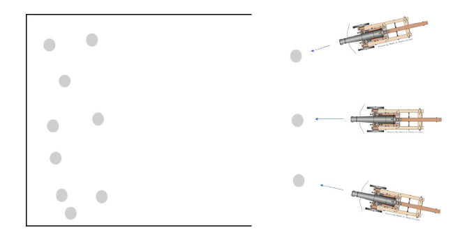

# [SECOND PROJECT] Computer Graphics

## Summary
  
We were asked to do a representation of this image in  with the following actions  
* Use keys **Q**, **W** and **E** to select cannons 1, 2 and 3, respectively  
* Use **arrow** keys to move the selected cannon  
* Use **space** key to fire the selected cannon
* Define three cameras: one orthogonal with upper view of the field(**1**), a perspective camera with a front view (**2**) and ball camera (perspective) that follows the last ball fired (**3**). Change between cameras using keys **1** to **3**  

Notes: 
* There are already a random number of balls in the field  
* Balls should slow down
* Collisions exist  
  
---
  
You can check https://ist-cg-p2.netlify.com where our project is deployed  

## Check  for more detailed info (in Portuguese)

## Authors 
| Name | University | More info |
| ---- | ---- | ---- |
| Afonso Matos | Instituto Superior Técnico |    |
| Ricardo Fernandes | Instituto Superior Técnico |    |
| Tomás Lopes | Instituto Superior Técnico |    |
